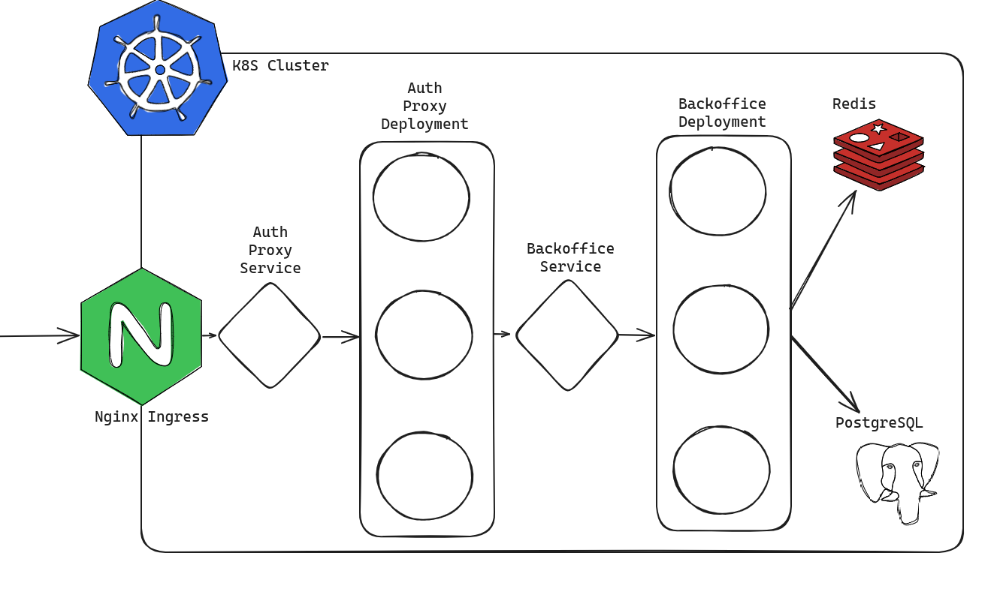
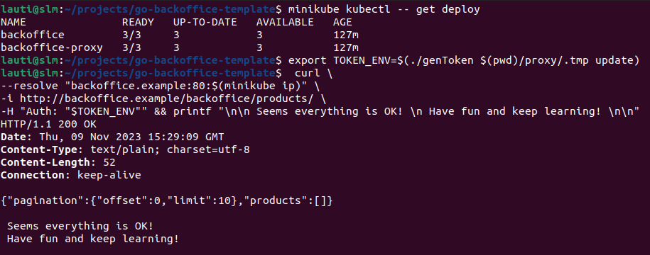

# Go backoffice template

The present project is a template for a http server that implements a simple crud to handle backoffice database interactions, a reverse proxy that handles JWT signature validation, and a kubernetes deployment. 

As an example, it implements cruds for products and users but it can be extended to include any kind of entity. 

The project uses PostgreSQL for persistence, and Redis as a message broker.

I hope you find this didactic example useful :) 

## Architecture



As we can see in the diagram, the project has been conceived to be deployed in a kubernetes cluster.

The flow is the following:
1. An ingress gets requests from the internet.
2. It forwards the requests to the auth proxy deployment.
3. The proxy decodes and validates the JWT present in the Auth header.
4. If the JWT is not valid or is not present, it delivers an early response.
5. If everything is OK, it changes the request adding some headers.
6. Finally it forwards the request to the main application.
7. The application is responsible for checking permissions and interacting with the DB (Postgres) and the message broker (Redis).

## API

The endpoints are standard REST APIs:

```sh
# To list resources
GET http://backoffice.example/backoffice/{ products | users }

# To get by ID
GET http://backoffice.example/backoffice/{ products | users }/{id}

# To create an entity
POST http://backoffice.example/backoffice/{ products | users }/

# To replace an entity
PUT http://backoffice.example/backoffice/{ products | users }/

# To delete
DELETE http://backoffice.example/backoffice/{products | users}/{id}
```

## Minikube deployment

If you want to try this out in minikube you can follow these steps.

### 1. Enable addons

```bash
minikube addons enable helm-tiller
minikube addons enable ingress
minikube addons enable registry 
```

### 2. Build and push docker images into minikube's docker registry

```bash
eval $(minikube docker-env)
docker build -t backoffice localhost:5000/backoffice
docker push localhost:5000/backoffice
docker build -t auth_proxy localhost:5000/auth_proxy
docker push localhost:5000/auth_proxy

```

### 3. Deploy Redis and Postgres

```bash
helm repo add bitnami https://charts.bitnami.com/bitnami
helm install -f _k8s/helm_redis/values.yaml redis bitnami/redis
helm install -f _k8s/helm_postgres/values.yaml postgres bitnami/postgresql
```

### 4. Create keys for the proxy and update the configmap
```bash
make gen-test-keys
# keys will be in proxy/.tmp/{public.pem, private.pem}
# now update the configmap field in _k8s/proxy_configmap.yaml
# so it has the new public key in data.PUBLIC_KEY
```

### 5. Deploy the application
```bash
# change the ingress so it points directly to the backoffice service and then
minikube kubectl -- create -f ./_k8s
```

### 6. Test endpoints w/o the proxy

After this, you will be able to reach our application through the ingress.

The simplest way to interact is by using `curl`.

Remember that you choose not to deploy the auth proxy, you will need to change the ingress and provide value for `X-Decoded-Role` header so the auth middleware allows you to reach the actual endpoint.

See [role package](./roles/roles.go) and [middleware package](./api/http/middleware/middleware.go) 

```bash
curl \
--resolve "backoffice.example:80:$(minikube ip)" \
-i http://backoffice.example/backoffice/products/ \
-H "X-Decoded-Perms: 1"
```

### 7. Test the whole deployment

If you want to test the whole deployment first deploy everything with:

```bash
minikube kubectl -- create -f ./_k8s
```

After that I recommend to build and use the `genToken` binary:
```bash
# after make gen-test-keys
make build-token-generator

# first arg is where the keys are
# if second arg is "update" it will create a fresh token
./genToken $(pwd)/proxy/.tmp update
```
Then, you will have the token as the output of the command, so you can build your http request as follows:

```bash
export TOKEN_ENV=$(./genToken $(pwd)/proxy/.tmp update)

curl \
--resolve "backoffice.example:80:$(minikube ip)" \
-i http://backoffice.example/backoffice/products/ \
-H "Auth: "$TOKEN_ENV""
```

A working deployment should work as the following screenshot:



## Run tests

For this project we decided to perform tests using an actual Redis and Postgresql connection, more like a Behavior/acceptance tests, or an integration test.

To try them out you can use our provided docker-compose files and make scripts:

```bash
# this will create RSA keys for the auth proxy
make gen-test-keys

# this will run redis and postgres
make run-external

# this will run all tests
make test

# this will terminate all containers we created
make terminate-external

# and this will clean the generated RSA keys
make clean
```

## The Monkey
